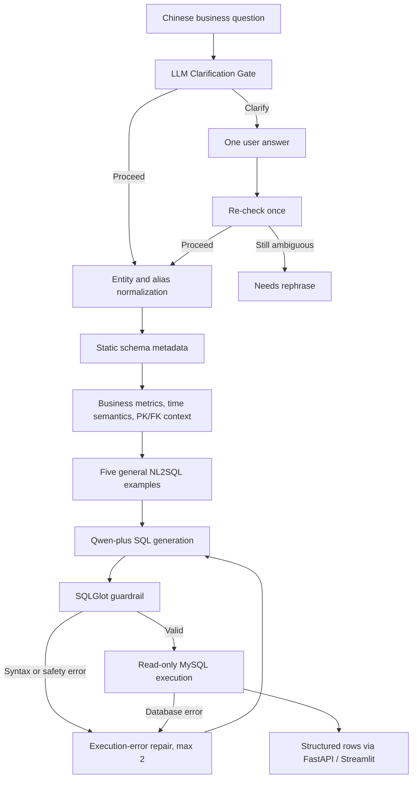

# Agentic Data Analyst

Agentic Data Analyst is a business-oriented natural-language-to-SQL analytics system for structured MySQL data.

It converts Chinese business questions into executable SQL, applies fixed business metric and time semantics, validates every statement through deterministic guardrails, executes queries with a read-only database account, and returns structured analytical results.

## Overview

Release v1.1 adds one LLM clarification gate in front of the frozen v1.0 production engine. Qwen decides whether existing business definitions and the question are sufficient. A materially ambiguous request receives one concise Chinese clarification question; a clear request proceeds directly to SQL generation. The underlying engine still uses complete static schema metadata, fixed vocabulary normalization, and general SQL examples.

The included e-commerce schema covers users, products, orders, order items, and refunds. All records are synthetic and reproducibly generated for local development and evaluation.

## Key Features

- LLM clarification with strict Pydantic output, temperature 0, and at most one user clarification round.
- Stateless follow-up requests, safe format/network failure handling, and a Chinese interactive Streamlit UI.
- One-command local startup with project-owned PID files, health checks, and separate logs.
- Business Metric Dictionary for sales, quantity, valid orders, paying users, and approved refunds.
- Explicit time semantics for calendar periods and reference-date-based ranges.
- Complete table, column, data type, primary key, and foreign key context.
- Fixed entity and business vocabulary normalization.
- Five general NL2SQL examples for aggregation, filtering, ranking, joins, and grouping.
- Qwen-plus SQL generation through DashScope.
- SQLGlot guardrails that permit only one read-only `SELECT` or `WITH ... SELECT` statement.
- Automatic row limiting and a read-only MySQL application account.
- Execution-error retry with a maximum of two retries.
- FastAPI API, Streamlit interface, Dockerized MySQL, and a frozen evaluation pipeline.

## Architecture



The API calls `app.agent.production.run_interactive`. It delegates accepted requests to the unchanged Release v1.0 engine. `run_question` remains the direct v1.0 entrypoint for reproducible comparisons. The gate is not a query-category router, ReAct agent, or function-calling agent.

## Interactive Clarification

The gate receives the production business definitions, schema, PK/FK relationships, vocabulary and reference date. Defined metrics such as sales amount, quantity and valid orders do not need to be redefined by the user. Missing optional detail is not a reason to interrupt a query.

Both turns use `POST /api/query`:

```json
{"question": "最近销售怎么样？"}
```

When `status` is `needs_clarification`, display `clarification_question` and preserve the returned `clarification_context` verbatim. Send the next request with the same original `question`, that context, and `clarification_answer`. The backend merges the original constraints with the answer and rechecks once. Further ambiguity returns `needs_rephrase` without executing SQL. Invalid model JSON gets one format retry; an unresolved format or service error returns `clarification_unavailable` without SQL.

The API stores no conversation memory. The one-round limit applies to the submitted interaction context, not to a user starting a new request. Clear-query reference dates default to the server's current date; evaluation supplies a frozen reference date. An explicit reference date in the question remains authoritative.

The Chinese UI preserves the pending clarification across reruns. Successful queries show status, total request latency and retries, with separate result, SQL and execution tabs. A two-column categorical/numeric result can optionally be shown as a simple bar chart. Transport failures retain the pending question for retry.

## Why This Design

Structured business queries do not always benefit from more reasoning stages. A full agentic workflow and a deterministic complexity router were evaluated, but the compact NL2SQL engine produced the best accuracy and latency trade-off on the final frozen holdout.

The release therefore favors fixed and inspectable semantics, complete schema grounding, deterministic safety controls, and a short execution path that is easier to test and explain.

## Evaluation

Frozen **v1.0** Final Release Holdout: 300 previously unseen business queries. These results are retained unchanged and are not rerun to evaluate v1.1 clarification.

| Metric | Result |
|---|---:|
| End-to-End Accuracy | **73.67% (221/300)** |
| Average Latency | **2.76s** |
| Easy | 88.67% |
| Medium | 55.83% |
| Hard | 70.00% |
| Filtering / Aggregation | 90.00% |
| JOIN | 73.33% |
| Top-K / Ranking | 86.67% |
| Time / Trend | 41.67% |
| Refund / Customer / Product | 80.00% |
| Complex | 40.00% |
| Paraphrase | 63.89% |

Evaluation discipline:

- The benchmark, Reference SQL, and database-derived Ground Truth were frozen before execution.
- All 300 questions were unique and the benchmark was executed once for the final score.
- No failed case was removed or relabeled.
- No benchmark-specific tuning occurred after results were revealed.
- Exact result comparison uses a numeric absolute tolerance of 0.005 and preserves ordering when requested.

See [FINAL_EVALUATION.md](FINAL_EVALUATION.md) for the protocol and complete category summary.

## Tech Stack

| Layer | Technology |
|---|---|
| Chat model | Qwen-plus via DashScope |
| Database | MySQL 8.4 |
| SQL parsing and safety | SQLGlot |
| API | FastAPI and Uvicorn |
| UI | Streamlit |
| Database client | PyMySQL |
| Testing | pytest |
| Local infrastructure | Docker Compose |

## Project Structure

```text
agentic-data-analyst/
├── app/
│   ├── agent/production.py
│   ├── tools/
│   ├── config.py
│   └── main.py
├── data/
│   ├── init.sql
│   └── seed_data.py
├── eval/
│   ├── final_release_holdout_300.json
│   ├── final_release_manifest.json
│   ├── final_results.json
│   ├── final_report.json
│   ├── scoring.py
│   └── run_final_evaluation.py
├── scripts/
├── tests/
├── ui/
├── docker-compose.yml
├── requirements.txt
├── .env.example
├── FINAL_EVALUATION.md
├── ATTRIBUTION.md
└── LICENSE
```

## Quick Start

### 1. Clone and install

```bash
git clone https://github.com/jinxi0407/agentic-data-analyst.git
cd agentic-data-analyst
python3 -m venv .venv
source .venv/bin/activate
pip install -r requirements.txt
```

### 2. Configure the environment

```bash
cp .env.example .env
```

Set `DASHSCOPE_API_KEY`, `MYSQL_PASSWORD`, and `MYSQL_ROOT_PASSWORD` in `.env`. The configured models are qwen-plus and text-embedding-v4; the production SQL path uses qwen-plus.

### 3. Start and initialize MySQL

```bash
docker compose up -d mysql
python scripts/init_database.py
python data/seed_data.py
python scripts/set_readonly_user.py
```

`data/seed_data.py` replaces data in this project's five business tables. Run it only when you intend to reset the local synthetic dataset.

### 4. Start API and UI together

```bash
./scripts/start_local.sh
```

This requires an existing `.venv` and configured `.env`. It starts only this project's MySQL service, waits for MySQL, FastAPI and Streamlit health checks, then opens `http://127.0.0.1:8502` on macOS. API documentation is at `http://127.0.0.1:8002/docs`. Startup never seeds or resets your database and does not reinstall packages.

Recorded processes are in `.run/fastapi.pid` and `.run/streamlit.pid`; logs are in `logs/fastapi.log` and `logs/streamlit.log`. A restart verifies PID identity before stopping recorded processes. An unknown process occupying a port causes startup to exit without killing it. To stop only recorded project API/UI processes, leaving MySQL running:

```bash
./scripts/stop_local.sh
```

Endpoints:

```text
GET  /health
POST /api/query
```

Example request:

```bash
curl -X POST http://127.0.0.1:8002/api/query \
  -H 'Content-Type: application/json' \
  -d '{"question":"最近30天有效订单销售额是多少？"}'
```

### 5. Optional separate terminals

```bash
uvicorn app.main:app --host 127.0.0.1 --port 8002
# In a second terminal, instead of using the one-command launcher:
streamlit run ui/app.py --server.port 8502 --server.address 127.0.0.1
```

Processes started manually are not owned by the launcher. Stop those terminals before switching to one-command startup.

On macOS, an iCloud-synced Documents directory can offload virtual-environment files and make
Python imports very slow. Keep dependencies local. A project-local `.venv.nosync` with `.venv`
pointing to it is supported by the launcher; both paths and environment backups are ignored.
The launcher does not move or recreate environments automatically.

### Clarification evaluation

The dedicated protocol and current evaluation status are in
[docs/CLARIFICATION_EVALUATION.md](docs/CLARIFICATION_EVALUATION.md). The 80-case development
set and the independently generated 120-case holdout measure clarification behavior and
interactive result correctness. They do not replace the frozen v1.0 300-case score.

The first holdout's preflight identified a city-literal mismatch in Reference SQL. It has not
been run against either model pipeline; final v1.1 scores and release remain pending an audited
ground-truth resolution. Do not use provisional development E2E scores as resume metrics.

### 6. Run tests and verify the frozen evaluation

```bash
pytest -q
python eval/run_final_evaluation.py
```

The repository includes the frozen per-case results. The evaluation command validates the benchmark digest and database fingerprint, then reproduces the aggregate report without making unnecessary model calls when all results are already present.

## Example Queries

```text
近一个月有效订单的成交额是多少？
列出销量排名前十的商品。
各城市分别有多少笔有效订单？
上个自然月哪些商品品类的退款金额最高？
按月查看近半年的成交趋势。
累计消费最多的客户有哪些？
```

## Safety

- SQL is parsed with SQLGlot before execution.
- Only a single `SELECT` or `WITH ... SELECT` statement is accepted.
- Mutating and administrative keywords are blocked.
- Result size is capped by `SQL_MAX_ROWS`.
- The application database user receives only `SELECT` privileges.
- Secrets are loaded from `.env`, which is excluded from Git.

Guardrails reduce risk but are not a substitute for database isolation, least-privilege credentials, query timeouts, and human review in sensitive environments.

## Experimental Findings

We also evaluated a full agentic workflow and a complexity-aware hybrid router.

| System | Accuracy | Average latency |
|---|---:|---:|
| Production NL2SQL Engine | 73.67% | 2.76s |
| Complexity-aware Hybrid | 71.33% | 3.65s |

More reasoning steps did not consistently improve structured business query accuracy, so the simpler and faster pipeline was selected for Release v1.0. Historical experiments are retained in Git history rather than presented as additional production versions.

## Limitations

- The included business dataset is synthetic.
- Evaluation uses one fixed local e-commerce schema with five business tables.
- Schema scale and cross-database generalization have not been established.
- Time and trend questions remain the weakest evaluated category.
- Complex queries still have significant failure cases.
- Generated SQL must still be treated as untrusted input outside the provided guardrails.

## Open-Source Attribution

This project was developed through substantial secondary development based on [woshixiaojunle/NL2SQL-Demo](https://github.com/woshixiaojunle/NL2SQL-Demo).

The original project is licensed under the Apache License 2.0. Major extensions include business semantics, MySQL schema metadata, vocabulary normalization, SQL safety, reproducible evaluation infrastructure, API/UI integration, and release engineering. See [ATTRIBUTION.md](ATTRIBUTION.md) and [LICENSE](LICENSE).
