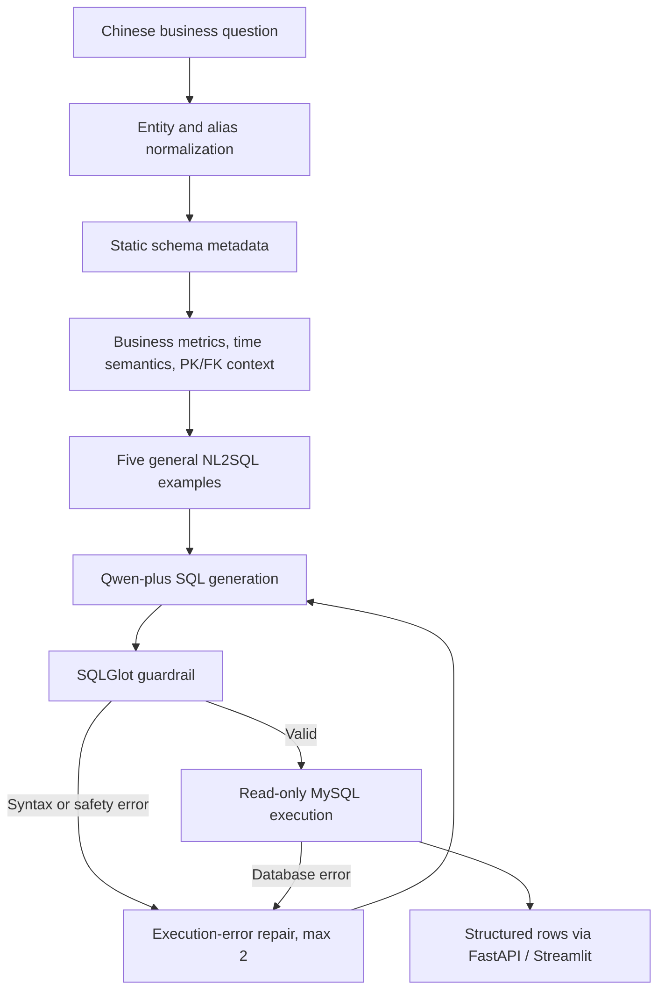

# Agentic Data Analyst

Agentic Data Analyst is a business-oriented natural-language-to-SQL analytics system for structured MySQL data.

It converts Chinese business questions into executable SQL, applies fixed business metric and time semantics, validates every statement through deterministic guardrails, executes queries with a read-only database account, and returns structured analytical results.

## Overview

Release v1.0 focuses on a compact and explainable production NL2SQL pipeline. The engine uses complete static schema metadata, explicit business definitions, fixed vocabulary normalization, and a small set of general SQL examples. It intentionally avoids adding planning stages when a single well-grounded SQL generation step is sufficient.

The included e-commerce schema covers users, products, orders, order items, and refunds. All records are synthetic and reproducibly generated for local development and evaluation.

## Key Features

- Business Metric Dictionary for sales, quantity, valid orders, paying users, and approved refunds.
- Explicit time semantics for calendar periods and reference-date-based ranges.
- Complete table, column, data type, primary key, and foreign key context.
- Fixed entity and business vocabulary normalization.
- Five general NL2SQL examples for aggregation, filtering, ranking, joins, and grouping.
- Qwen-plus SQL generation through DashScope.
- SQLGlot guardrails that permit only one read-only `SELECT` or `WITH ... SELECT` statement.
- Automatic row limiting and a read-only MySQL application account.
- Execution-error retry with a maximum of two retries.
- FastAPI API, Streamlit interface, Dockerized MySQL, and a frozen evaluation pipeline.

## Architecture



The default application entrypoint is `app.agent.production`, which delegates to the frozen Release v1.0 engine. Historical agentic workflow experiments remain available through Git history and the local pre-release archive tag, but are not the production path.

## Why This Design

Structured business queries do not always benefit from more reasoning stages. A full agentic workflow and a deterministic complexity router were evaluated, but the compact NL2SQL engine produced the best accuracy and latency trade-off on the final frozen holdout.

The release therefore favors fixed and inspectable semantics, complete schema grounding, deterministic safety controls, and a short execution path that is easier to test and explain.

## Evaluation

Final Release Holdout: 300 previously unseen business queries.

| Metric | Result |
|---|---:|
| End-to-End Accuracy | **73.67% (221/300)** |
| Average Latency | **2.76s** |
| Easy | 88.67% |
| Medium | 55.83% |
| Hard | 70.00% |
| Filtering / Aggregation | 90.00% |
| JOIN | 73.33% |
| Top-K / Ranking | 86.67% |
| Time / Trend | 41.67% |
| Refund / Customer / Product | 80.00% |
| Complex | 40.00% |
| Paraphrase | 63.89% |

Evaluation discipline:

- The benchmark, Reference SQL, and database-derived Ground Truth were frozen before execution.
- All 300 questions were unique and the benchmark was executed once for the final score.
- No failed case was removed or relabeled.
- No benchmark-specific tuning occurred after results were revealed.
- Exact result comparison uses a numeric absolute tolerance of 0.005 and preserves ordering when requested.

See [FINAL_EVALUATION.md](FINAL_EVALUATION.md) for the protocol and complete category summary.

## Tech Stack

| Layer | Technology |
|---|---|
| Chat model | Qwen-plus via DashScope |
| Database | MySQL 8.4 |
| SQL parsing and safety | SQLGlot |
| API | FastAPI and Uvicorn |
| UI | Streamlit |
| Database client | PyMySQL |
| Testing | pytest |
| Local infrastructure | Docker Compose |

## Project Structure

```text
agentic-data-analyst/
├── app/
│   ├── agent/production.py
│   ├── tools/
│   ├── config.py
│   └── main.py
├── data/
│   ├── init.sql
│   └── seed_data.py
├── eval/
│   ├── final_release_holdout_300.json
│   ├── final_release_manifest.json
│   ├── final_results.json
│   ├── final_report.json
│   ├── scoring.py
│   └── run_final_evaluation.py
├── scripts/
├── tests/
├── ui/
├── docker-compose.yml
├── requirements.txt
├── .env.example
├── FINAL_EVALUATION.md
├── ATTRIBUTION.md
└── LICENSE
```

## Quick Start

### 1. Clone and install

```bash
git clone https://github.com/jinxi0407/agentic-data-analyst.git
cd agentic-data-analyst
python3 -m venv .venv
source .venv/bin/activate
pip install -r requirements.txt
```

### 2. Configure the environment

```bash
cp .env.example .env
```

Set `DASHSCOPE_API_KEY`, `MYSQL_PASSWORD`, and `MYSQL_ROOT_PASSWORD` in `.env`. The configured models are qwen-plus and text-embedding-v4; the production SQL path uses qwen-plus.

### 3. Start and initialize MySQL

```bash
docker compose up -d mysql
python scripts/init_database.py
python data/seed_data.py
python scripts/set_readonly_user.py
```

`data/seed_data.py` replaces data in this project's five business tables. Run it only when you intend to reset the local synthetic dataset.

### 4. Start the API

```bash
uvicorn app.main:app --host 127.0.0.1 --port 8002
```

Endpoints:

```text
GET  /health
POST /api/query
```

Example request:

```bash
curl -X POST http://127.0.0.1:8002/api/query \
  -H 'Content-Type: application/json' \
  -d '{"question":"最近30天有效订单销售额是多少？"}'
```

### 5. Start the UI

```bash
streamlit run ui/app.py --server.port 8502 --server.address 127.0.0.1
```

### 6. Run tests and verify the frozen evaluation

```bash
pytest -q
python eval/run_final_evaluation.py
```

The repository includes the frozen per-case results. The evaluation command validates the benchmark digest and database fingerprint, then reproduces the aggregate report without making unnecessary model calls when all results are already present.

## Example Queries

```text
近一个月有效订单的成交额是多少？
列出销量排名前十的商品。
各城市分别有多少笔有效订单？
上个自然月哪些商品品类的退款金额最高？
按月查看近半年的成交趋势。
累计消费最多的客户有哪些？
```

## Safety

- SQL is parsed with SQLGlot before execution.
- Only a single `SELECT` or `WITH ... SELECT` statement is accepted.
- Mutating and administrative keywords are blocked.
- Result size is capped by `SQL_MAX_ROWS`.
- The application database user receives only `SELECT` privileges.
- Secrets are loaded from `.env`, which is excluded from Git.

Guardrails reduce risk but are not a substitute for database isolation, least-privilege credentials, query timeouts, and human review in sensitive environments.

## Experimental Findings

We also evaluated a full agentic workflow and a complexity-aware hybrid router.

| System | Accuracy | Average latency |
|---|---:|---:|
| Production NL2SQL Engine | 73.67% | 2.76s |
| Complexity-aware Hybrid | 71.33% | 3.65s |

More reasoning steps did not consistently improve structured business query accuracy, so the simpler and faster pipeline was selected for Release v1.0. Historical experiments are retained in Git history rather than presented as additional production versions.

## Limitations

- The included business dataset is synthetic.
- Evaluation uses one fixed local e-commerce schema with five business tables.
- Schema scale and cross-database generalization have not been established.
- Time and trend questions remain the weakest evaluated category.
- Complex queries still have significant failure cases.
- Generated SQL must still be treated as untrusted input outside the provided guardrails.

## Open-Source Attribution

This project was developed through substantial secondary development based on [woshixiaojunle/NL2SQL-Demo](https://github.com/woshixiaojunle/NL2SQL-Demo).

The original project is licensed under the Apache License 2.0. Major extensions include business semantics, MySQL schema metadata, vocabulary normalization, SQL safety, reproducible evaluation infrastructure, API/UI integration, and release engineering. See [ATTRIBUTION.md](ATTRIBUTION.md) and [LICENSE](LICENSE).

