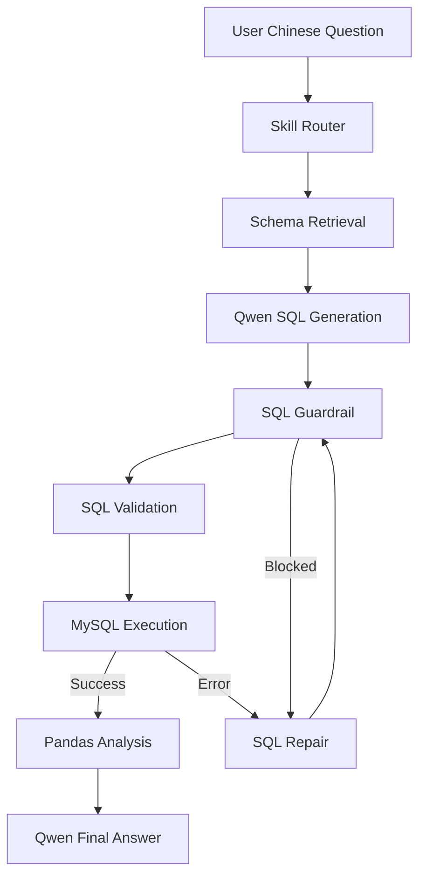

# Agentic Data Analyst

企业智能数据分析 Agent，用中文自然语言提问，系统自动选择分析 Skill、检索相关 Schema、生成安全 MySQL SQL、执行查询、用 Pandas 做确定性分析，并返回业务解释。

Based on / adapted from: `woshixiaojunle/NL2SQL-Demo`.

本项目保留原仓库 License 和必要 attribution。原始项目的核心思路是：把表结构元数据写入 `core_table` / `core_field`，用 DashScope embedding 做 schema retrieval，再用 LangGraph 编排 NL2SQL 和 retry。本项目在此基础上升级为独立的本地演示项目。

## 项目边界

- 当前项目目录：`/Users/jinxi/Documents/agentic-data-analyst`
- 独立 MySQL：`127.0.0.1:3307 -> Docker MySQL:3306`
- 独立 database：`agentic_data_analyst`
- 独立 container：`agentic-data-analyst-mysql`
- 独立 volume：`agentic_data_analyst_mysql_data`
- 独立 network：`agentic_data_analyst_net`
- FastAPI：`http://127.0.0.1:8002`
- Streamlit UI：`http://localhost:8502`
- 不使用 Redis、Milvus、Qdrant、Elasticsearch、Neo4j、MCP、A2A、Multi-Agent。

## 系统架构



## Agent Workflow

1. 用户输入中文问题。
2. `Skill Router` 根据问题选择 `sales_analysis`、`refund_analysis` 或 `trend_analysis`。
3. 系统读取对应 `skills/*/SKILL.md`，把 Skill 规则放入 SQL prompt。
4. `Schema Retrieval` 将问题向量和表/字段描述向量做余弦相似度，只给 LLM 相关 schema。
5. Qwen / DashScope 生成 MySQL SQL。
6. `sqlglot` 做 deterministic Guardrail，只允许 `SELECT` 或 `WITH ... SELECT`。
7. 自动补充或收紧 `LIMIT`，最多返回 `SQL_MAX_ROWS`。
8. MySQL 执行 SQL，失败后把错误交给 Qwen repair，最多 `MAX_RETRY=2`。
9. Pandas 对返回结果做确定性统计。
10. Qwen 只负责解释结果，不凭空计算数字。

## Skills

```text
skills/
├── sales_analysis/SKILL.md
├── refund_analysis/SKILL.md
└── trend_analysis/SKILL.md
```

Skill 不是简单标签。系统会真正读取 `SKILL.md`，并把其中的分析约束加入 SQL 生成 prompt。

## Guardrail

Guardrail 位于 `app/tools/guardrail.py`：

- 只允许单条 SQL。
- 只允许 `SELECT` 或 `WITH ... SELECT`。
- 禁止 `INSERT / UPDATE / DELETE / DROP / ALTER / TRUNCATE / CREATE / GRANT / REVOKE` 等危险操作。
- 自动添加或收紧 `LIMIT`。
- 使用 `sqlglot` 解析，不依赖 LLM 自我判断。
- 数据库用户后续会被脚本收紧为只读权限，作为第二层保护。

## Docker

启动独立 MySQL：

```bash
docker compose up -d mysql
```

验证：

```bash
docker exec agentic-data-analyst-mysql mysql -uroot -p -e "SELECT VERSION(); SELECT DATABASE();"
```

不要对其他项目执行 `docker stop/rm/down/prune`。

## 本地启动

1. 填写 `.env`：

```makefile
DASHSCOPE_API_KEY=
QWEN_CHAT_MODEL=
QWEN_EMBEDDING_MODEL=
MYSQL_PASSWORD=
MYSQL_ROOT_PASSWORD=
```

2. 安装依赖：

```bash
python3 -m venv .venv
source .venv/bin/activate
pip install -r requirements.txt
```

3. 启动 MySQL 并初始化数据：

```bash
docker compose up -d mysql
python scripts/init_database.py
python data/seed_data.py
python scripts/init_schema_embeddings.py
python scripts/set_readonly_user.py
```

4. 启动 API：

```bash
uvicorn app.main:app --host 127.0.0.1 --port 8002
```

5. 启动 UI：

```bash
streamlit run ui/app.py --server.port 8502 --server.address 127.0.0.1
```

或使用脚本：

```bash
bash scripts/start_local.sh
```

## API

```http
GET /health
POST /api/query
```

请求示例：

```json
{
  "question": "最近三个月退款率最高的5个商品是什么？"
}
```

响应包含：

- `skill`
- `matched_tables`
- `matched_columns`
- `sql`
- `retry_count`
- `result`
- `analysis`
- `latency_ms`
- `trace`

## Evaluation

Golden Questions 位于 `eval/cases.json`，覆盖 simple、filtering、aggregation、Top-K、time range、JOIN、complex conditions、trend、refund analysis。

运行：

```bash
python eval/run_eval.py
```

评估会真实统计：

- Execution Accuracy
- SQL Execution Rate
- Repair Success Rate
- Average Retry
- Average Latency

如果 API Key、网络或数据库未准备好，评估会失败并记录真实错误，不伪造数字。

## Final Benchmark - Agent v1 Strong Baseline

最终冻结候选评估使用 `eval/final_benchmark.py`，基于固定参考日期 `2026-09-12` 和 seeded MySQL reference SQL 生成 ground truth。

数据规模：

```json
{
  "users": 3000,
  "products": 800,
  "orders": 12000,
  "order_items": 27523,
  "refunds": 3080
}
```

评估集：

- Main Set: 240
- Real-user Paraphrase Set: 40
- Repair Challenge: 20
- Safety Set: 30

核心指标：

| Metric | Baseline | Agent |
|---|---:|---:|
| Execution Accuracy | 0.1571 | 0.5000 |
| SQL Execution Rate | 0.9750 | 0.9786 |
| Average Retry | 0.00 | 0.04 |
| Average Latency ms | 3742.28 | 7465.85 |

补充指标：

- Schema Retrieval Recall@K: `1.0000`
- Repair Success Rate: `0.8000`
- Guardrail Block Rate: `1.0000`
- Guardrail False Positive Rate: `0.0000`
- Guardrail False Negative Rate: `0.0000`

详细报告：

- `FINAL_EVALUATION.md`
- `docs/AGENT_V1_EVALUATION.md`
- `docs/RESUME_METRICS.md`
- `eval/final_report.json`

## Demo Questions

```text
最近30天销售额最高的5个商品是什么？
最近三个月退款率最高的商品有哪些？
过去六个月每月销售额趋势怎么样？
消费金额最高的10位客户是谁？
```

## 旧文件说明

这些文件来自原始 NL2SQL-Demo，保留作为学习和迁移对照：

- `langGraph_sql_agent.py`
- `init_table_embbeding.py`
- `db_connection.py`
- `repository.py`
- `models.py`
- `初始化表.sql`
- `执行步骤.md`

新项目运行入口使用 `app/`、`data/`、`skills/`、`eval/`、`ui/` 和 `docker-compose.yml`。
