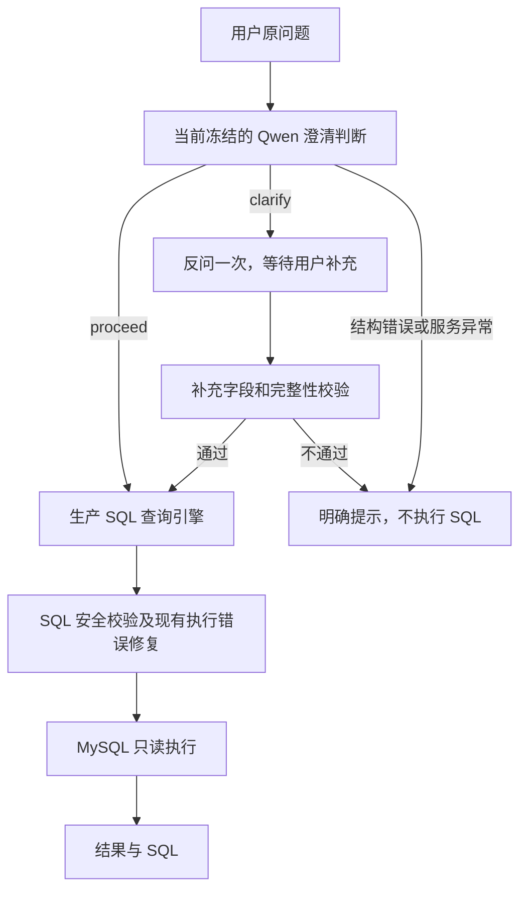

# QueryMate｜支持主动澄清的智能问数系统

面向电商结构化数据的中文问数工具。用户直接提问，系统判断是否需要补充关键信息，
再生成 MySQL SQL，经过安全校验和只读执行后展示结果。
当前发布目标为 **v1.2.0**，功能冻结于 `269a441`。人工浏览器两轮交互已由用户验收通过。
本次在原冻结200题上重新完整运行 OFF/ON，结果为 **71.00% → 77.50%，+6.50pp**。
这是已揭晓测试集上的回归，不是新盲测。详见[最终回归报告](FINAL_MIXED_CLARIFICATION_REGRESSION.md)
和[本次验收记录](docs/QUERYMATE_V1_2_RELEASE_ACCEPTANCE.md)。

## 自动判断，必要时反问一次

**页面新会话默认开启“自动判断是否澄清”**，不要求用户先判断自己的问题是否明确。
高级设置保留关闭入口。**API 不传 `mode` 时仍默认直接查询，不调用 Gate**，保持已有调用者兼容。



Gate 使用 JSON Object、原 Schema 和 Pydantic 校验，不恢复旧 strict JSON Schema 传输路径。
明确问题原样进入查询流程；补充只用于缺少的字段，保留已有条件。
新问题或模式切换会清理上一题待补充状态。无效输出不会自动变成 `proceed`。
这不是多智能体、ReAct 或原生 Function Calling 系统。

两种模式共享生产引擎、业务定义、时间语义、完整 Schema/FK、城市元数据、安全校验和执行重试。
Chat 使用配置中的 `qwen-plus`；`text-embedding-v4` 配置保留，当前静态 Schema 路径不调用 embedding。
入口为 `app/main.py`，公共流程位于 `app/agent/scoped_clarification.py`；
`eval/strong_baseline.py` 和 `eval/strong_baseline_v2.py` 仍是生产依赖，不能按文件名称删除。

## 日常启动与停止

要求 Docker Desktop 已运行，本项目数据库已初始化，`.venv` 与 `.env` 已配置。

```bash
cd agentic-data-analyst
bash scripts/start_local.sh
```

- 页面：<http://127.0.0.1:8502/>
- API：<http://127.0.0.1:8002/docs>；健康检查：`GET /health`
- MySQL：`127.0.0.1:3307` → 本项目容器 `3306`

脚本核对 PID 身份、项目路径、命令与运行文件指纹。健康且未改变的本项目服务复用；
未知进程占用端口时停止提示，不自动杀进程。`.run` 和 `logs` 只在本机使用。

```bash
bash scripts/stop_local.sh
```

停止只作用于本项目管理的 FastAPI/Streamlit，MySQL 保持运行。
不会重新 seed、清空数据库、重启 Docker Desktop 或操作金融/EduRAG 项目。

### 首次配置

仅在新克隆目录创建虚拟环境并安装 `requirements.txt`。使用 `.env.example` 配置自己的
DashScope Key 和本项目数据库密码，**不要覆盖已有 `.env`，不要提交真实配置**。
模型名、API 地址、数据库连接均从配置读取。
只有新建空数据库才使用 `scripts/init_database.py`、`data/seed_data.py` 和
`scripts/set_readonly_user.py`；seed 会替换合成数据，不属于日常启动或发布验收。

## API 使用

缺省仍是直接查询：

```bash
curl http://127.0.0.1:8002/api/query \
  -H 'Content-Type: application/json' \
  -d '{"question":"累计有效订单销售额是多少？只返回金额。"}'
```

显式开启当前澄清流程：

```json
{"question":"指定城市的累计有效订单销售额是多少？只返回金额。","mode":"clarify"}
```

收到 `needs_clarification` 后展示 `clarification_question`，保存返回的 `clarification_context`。
用户补充时发送同一原问题、`mode: "clarify"`、该 context 和 `clarification_answer`。
不要用改写后的完整问题替换原问题；新问题不携带旧 context/answer。
`/api/scoped-query` 也支持这套显式模式；`/api/query` 保留旧 context 的兼容补充入口。

HTTP 200 不代表业务成功。应检查 `status`：未解决的补充返回 `needs_rephrase`，
结构校验失败返回 `invalid_output`，服务异常返回 `system_error`，不会猜测执行。

## 最终200题 Regression Evaluation

在同一当前代码上重新运行原200条自建冻结题目：140条明确问题、60条单歧义问题。
两边均串行，使用相同模型、数据库、参考日期、业务上下文和结果比较逻辑。

| 指标 | OFF | ON |
|---|---:|---:|
| 全部问题结果准确率 | 142/200，71.00% | 155/200，77.50% |
| 明确问题结果准确率 | 125/140，89.29% | 123/140，87.86% |
| 歧义问题结果准确率 | 17/60，28.33% | 32/60，53.33% |
| 全部歧义题严格交互成功 | 不适用 | 22/60，36.67% |
| 平均系统处理耗时 | 4.153秒 | 5.660秒 |
| 平均模型调用 | 215/200，1.075次 | 445/200，2.225次 |

这是**自建合成混合评测，不是外部独立盲测，不代表线上请求分布**。
ON 仅在反问后获得一次经审核的模拟用户回答，因此比较交互效果，不是等信息条件下模型能力。
时间不含用户思考。本次完整运行400个首轮任务和32次补充，未重跑300题。
人工浏览器验收为 **PASS — manually verified by user**，不是自动浏览器测试。

### 限制与失败

- 澄清 Precision 100.00%（32/32）、Recall 53.33%（32/60）、F1 69.57%（64/92，公式计数）。
- 触发32/200（16.00%），漏澄清28/60（46.67%）；没有不必要澄清（0/140）。
- 歧义题严格交互成功22/60（36.67%），全体严格成功145/200（72.50%）；不能用碰巧答对替代成功澄清。
- 明确题净少答对2题（-1.43pp）。ON最终有4条执行失败和2条结构校验失败；所有失败均保留。
- 配对结果：两边正确138题，OFF正确但ON错误4题，OFF错误但ON正确17题，两边错误41题。
- SQL 安全不等于业务语义正确。多表聚合、业务指标解释和单轮补充仍有限制。
- 冻结评分采用结果比较及既有数值容差，合法空结果保留；结果匹配也可能包含偶然一致。

SQLGlot 限制单条只读 SELECT/WITH SELECT、返回行数，业务 MySQL 账号采用只读权限。
安全校验不能替代最小权限、数据隔离或敏感业务的人工复核。

## 证据与测试

```bash
.venv/bin/python -m pytest -q
```

普通测试使用 mock，本次为133 passed、2 warnings。旧离线冻结校验器不放宽哈希检查，
应在旧版本使用。当前回归使用独立运行器与结果文件，旧报告及原题库保持不变。

- [当前200题回归报告](FINAL_MIXED_CLARIFICATION_REGRESSION.md)
- [原200题历史报告](FINAL_MIXED_CLARIFICATION_EVALUATION.md)
- [评测文件入口与复现边界](eval/README.md)
- [当前文档及历史实验索引](docs/README.md)
- [当前简历事实](docs/CLARIFICATION_RESUME_FACTS.md)
- [当前发布验收](docs/QUERYMATE_V1_2_RELEASE_ACCEPTANCE.md)
- [文件分类清单](docs/QUERYMATE_FILE_INVENTORY.json)

历史120题、300题、城市修正及负向结论完整保留，不与当前200题拼接成提升。

## 开源来源与许可证

基于 [woshixiaojunle/NL2SQL-Demo](https://github.com/woshixiaojunle/NL2SQL-Demo) 二次开发，
保留原 [Apache License 2.0](LICENSE) 与[归属说明](ATTRIBUTION.md)。
正式私有仓库为 `jinxi0407/agentic-data-analyst`；origin 指向自己的仓库，upstream 仅标识原作者。
QueryMate 只改变产品显示名，不改仓库 URL、本地路径、包名或 Docker 资源名。
代码、文档、测试和正式证据可同步；密钥、虚拟环境、日志、PID 和数据库物理文件不上传。
