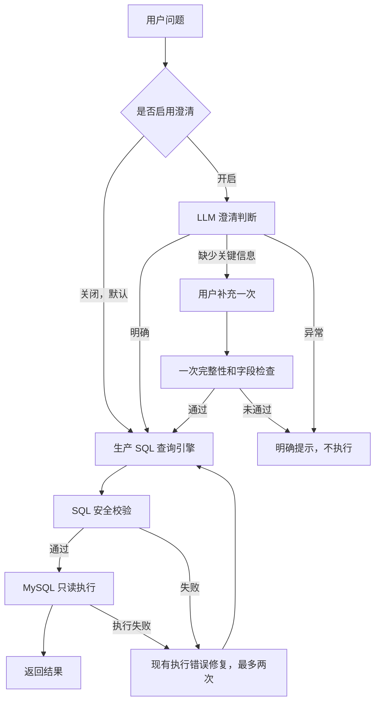

# Agentic Data Analyst

面向电商结构化数据的中文自然语言查询项目，基于 NL2SQL-Demo 二次开发。
将业务问题转换为 MySQL SQL，经过安全校验和只读执行后展示结果。
**v1.1.0：默认直接查询，可选单轮澄清。** 验收范围与待人工确认项见[验收记录](docs/V1_1_RELEASE_ACCEPTANCE.md)。

## 默认直接查询，可选一次澄清

API 和 UI 默认关闭主动澄清，直接使用本轮评测的同配置 Baseline 路径，不调用 Gate。
两版共用生产查询引擎、业务上下文、时间语义、完整 Schema/FK、城市元数据、SQL 安全及执行错误重试。
Chat 使用环境配置中的 qwen-plus；text-embedding-v4 配置保留，当前静态 Schema 路径不调用 embedding。

开启后，Qwen 判断是否缺少关键时间、指标或筛选信息，必要时问一次。
补充只用于被问字段，保留原问题条件。仍不完整返回 `needs_rephrase`，
结构或引用校验失败返回 `invalid_output`，服务异常返回 `system_error`，不猜测执行。
这不是 ReAct、原生 Function Calling 或多智能体方案，也没有公网部署。



入口为 `app/main.py`；公共处理和可选澄清在 `app/agent/scoped_clarification.py`，
冻结引擎在 `eval/strong_baseline_v2.py`。历史实现保留，不代表额外生产版本。

## 日常启动与停止

要求 Docker Desktop 已运行，本项目数据库已初始化，`.venv` 与 `.env` 已配置。

```bash
cd /Users/jinxi/Documents/agentic-data-analyst
bash scripts/start_local.sh
```

- 页面：<http://127.0.0.1:8502/>
- API：`http://127.0.0.1:8002`；接口文档：<http://127.0.0.1:8002/docs>
- 健康检查：`GET /health`
- MySQL：`127.0.0.1:3307` → 本项目容器 `3306`

健康、归属正确且运行文件未改变的 Web 服务可以复用；代码或配置改变时只重启本项目登记服务。
使用 PID 前核对身份和命令；未知进程占用端口时停止并提示，不自动杀进程。
`.run` 保存本地进程记录，`logs` 保存本地日志，均不上传 GitHub。

```bash
bash scripts/stop_local.sh
```

停止脚本只停止本项目管理的 FastAPI/Streamlit，MySQL 保持运行。
启动不会重新 seed、清空数据库、重新安装依赖或操作金融/EduRAG 项目。

### 仅首次建立独立环境

新克隆目录才需创建 `.venv` 并安装 `requirements.txt`，已有环境不要重复创建。
`.env.example` 仅是模板，**不要覆盖已有 `.env`**。填写自己的 DashScope Key 和本项目数据库密码。
模型名、接口地址、数据库连接从配置读取，真实配置不提交 Git。
只有新建空数据库时才使用 `scripts/init_database.py`、`data/seed_data.py` 和 `scripts/set_readonly_user.py`。
**seed 会替换本项目合成业务数据，不属于日常启动，不要在已有评测数据库上随意执行。**
本机 Documents 可能被 iCloud 卸载文件，依赖应保持本地可用，已有 `.venv.nosync` 方案保留。

## API 示例

默认请求向后兼容，仅提供 question 即可，不调用 Gate：

```bash
curl http://127.0.0.1:8002/api/query \
  -H 'Content-Type: application/json' \
  -d '{"question":"累计有效订单销售额是多少？只返回金额。"}'
```

显式开启：

```json
{"question":"这次选定支付方式的有效订单优惠总额是多少？","mode":"clarify"}
```

收到 `needs_clarification` 后展示 `clarification_question`，原样保存返回的 `clarification_context`。
下一次发送相同原问题，加上 `mode: "clarify"`、该 context 与用户填写的 `clarification_answer`。
不要自行构造 context 或用模型改写的完整问题替代用户输入。新问题不携带旧 context/answer。
UI 默认关闭“启用一次主动澄清”，新问题会清理旧补充状态。

`POST /api/scoped-query` 保留显式模式接口；`/api/query` 对新请求使用相同路径。
以前已返回的旧版 context 可在 `/api/query` 完成兼容补充，但新请求不会默认进入旧 Gate。
API 没有跨题长期记忆；一次澄清限制由当前交互 context 约束。

## 本轮冻结评测

自建合成冻结120题：明确60、单歧义60，歧义按时间、指标、筛选/实体各20题。
不是外部独立盲测，也不代表真实线上用户分布。

| 指标 | 同配置关闭澄清 Baseline | 开启一次澄清 Final |
|---|---:|---:|
| 结果准确率 | 71/120，59.17% | 88/120，73.33% |
| 明确问题结果 | 60/60，100% | 53/60，88.33% |
| 歧义问题结果 | 11/60，18.33% | 35/60，58.33% |
| 全部歧义题严格交互成功 | 不适用 | 34/60，56.67% |
| 全集严格交互成功 | 不适用 | 87/120，72.50% |
| 平均系统耗时 | 1.793秒 | 11.436秒 |
| 平均模型调用 | 1.042次 | 2.492次 |

结果净增17题，按原始计数为 +14.17 个百分点。
Final获得一次模拟用户补充，因此衡量交互价值，不是等信息条件下模型能力。
澄清判断 Accuracy=107/120（89.17%）、Precision=54/56（96.43%）、Recall=54/60（90%），
F1=108/116（93.10%，分母2TP+FP+FN）。**F1不是端到端准确率。**
结果正确与严格交互成功分别报告，未澄清碰巧答对不算歧义题严格成功。
耗时不含模拟用户思考；一次超时缺失usage，Token统计不能称为完整精确总用量。
明确题退化、校验失败和耗时增加，是默认关闭澄清的原因。本轮发布不重跑评测或调整核心。

## 安全与已知限制

- SQLGlot只允许单条只读SELECT或WITH SELECT，限制返回行数，MySQL业务账号仅有SELECT权限。
- 危险SQL只在校验层测试，不对业务表执行破坏性语句。
- 城市仅映射唯一已确认的同城别名；不存在城市允许合法空结果，不偷偷更换城市。
- Gate有格式/引用校验失败、过度澄清和漏澄清；补充后SQL仍可能业务含义错误。
- 明确题60/60降到53/60，不能宣称澄清适用于所有问题。
- 客单价曾误用每位客户消费额；简化业务上下文覆盖仍不完整，冻结后没有继续调参。
- 单轮与合成数据覆盖有限；安全校验不替代数据隔离、最小权限和敏感场景人工审核。
- HTTP200不代表业务成功，须检查响应status；UI会显示安全停止和错误提示。

## 文档与测试

```bash
.venv/bin/python -m pytest -q
```

普通测试使用mock并阻止未mock外呼，真实联调独立记录，不批量运行付费评测。

- [最终同集评测](FINAL_SCOPED_CLARIFICATION_EVALUATION.md)
- [历史指标审计](CLARIFICATION_METRIC_AUDIT.md)
- [可核验简历事实](docs/CLARIFICATION_RESUME_FACTS.md)
- [发布验收](docs/V1_1_RELEASE_ACCEPTANCE.md)
- [预注册协议](eval/SCOPED_CLARIFICATION_PROTOCOL.md)
- [冻结记录](eval/scoped_clarification_freeze.json)及[逐题结果](eval/scoped_clarification_per_case.json)
- [城市修正审计](eval/clarification_city_audit.json)
- [原版历史评测](FINAL_EVALUATION.md)

原v1.0独立300题为221/300（73.67%）、平均2.76秒，原记录与v1.0.0保留。
不能与本轮120题拼成提升，2.76秒也不是澄清模式延迟。

## 开源来源与许可证

基于 [woshixiaojunle/NL2SQL-Demo](https://github.com/woshixiaojunle/NL2SQL-Demo) 二次开发，
保留原 [Apache License 2.0](LICENSE) 与[归属说明](ATTRIBUTION.md)。
正式仓库为私有 jinxi0407/agentic-data-analyst，origin用于自己的仓库，upstream标识原作者，不向其推送。
代码、文档、测试与正式评测证据可以同步；真实配置、虚拟环境、日志、PID及数据库物理文件不上传。
